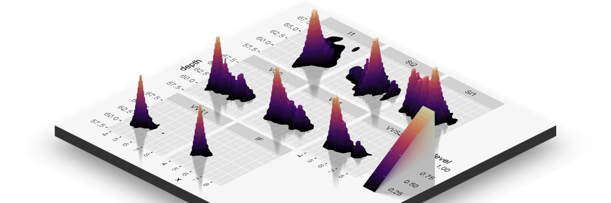

# Data Science Question A Day

This is an accompanying repository for the questions posted on Twitter by the account, Data Science Question a Day. You can follow the twitter account [@data_question](https://twitter.com/data_question) for daily questions on Data Science, Machine Learning, R programming and Python (possibly in future).

If in case, you find a correction in any of the questions, please do submit an issue request. If you would like to submit a question, please do submit an issue request.

Although this repository contains questions, the purpose of it is to act as a temporary placeholder for storing questions. Future plan is to migrate questions to more robust database and make the questions accessible via a website.

# Question List

|S.No|Date|Topic|Link|
|:---:|:---:|:---:|:---:|
|1|17 September 2020|Data Science,  Probability and Statistics,  Binomial Distribution|[Link](./questions/q_17092020.md)|
|2|16 September 2020|Data Science,  Probability and Statistics,  Binomial Distribution|[Link](./questions/q_16092020.md)|
|3|15 September 2020|Data Science,  Probability and Statistics,  Chi-squared Distribution|[Link](./questions/q_15092020.md)|
|4|14 September 2020|Data Science,  Probability and Statistics,  Binomial Test|[Link](./questions/q_14092020.md)|
|5|13 September 2020|Data Science,  Probability and Statistics,  Binomial Distribution|[Link](./questions/q_13092020.md)|
|6|12 September 2020|Programming,  R,  `seq_along()`|[Link](./questions/q_12092020.md)|
|7|11 September 2020|Programming,  R,  List|[Link](./questions/q_11092020.md)|
|8|10 September 2020|Data Science,  Probability and Statistics,  Normal Q-Q plot|[Link](./questions/q_10092020.md)|
|9|09 September 2020|Programming,  R,  S3 Class|[Link](./questions/q_09092020.md)|
|10|08 September 2020|Programming,  R,  Indexing|[Link](./questions/q_08092020.md)|
|11|07 September 2020|Programming,  R,  Indexing|[Link](./questions/q_07092020.md)|
|12|06 September 2020|Data Science,  Probability and Statistics,  Type 1 error and Type 2 error|[Link](./questions/q_06092020.md)|
|13|05 September 2020|Data Science,  Probability and Statistics,  Type 1 error and Type 2 error|[Link](./questions/q_05092020.md)|
|14|04 September 2020|Data Science,  Probability and Statistics,  Type 1 error and Type 2 error|[Link](./questions/q_04092020.md)|
|15|03 September 2020|Programming,  R,  Indexing|[Link](./questions/q_03092020.md)|
|16|02 September 2020|Data Science,  Probability and Statistics,  Type 1 error and Type 2 error|[Link](./questions/q_02092020.md)|
|17|01 September 2020|Data Science,  Probability and Statistics,  Type I error and Type II error|[Link](./questions/q_01092020.md)|
|18|31 August 2020|Programming,  R,  Indexing|[Link](./questions/q_31082020.md)|
|19|30 August 2020|Data Science,  Statstics,  Type 1 and Type 2 Error|[Link](./questions/q_30082020.md)|
|20|29 August 2020|Data Science,  Classification|[Link](./questions/q_29082020.md)|
|21|28 August 2020|R programming,  `[` operator|[Link](./questions/q_28082020.md)|
|22|27 August 2020|R programming,  `:` operator|[Link](./questions/q_27082020.md)|
|23|26 August 2020|ANOVA,  One way ANOVA,  Two way ANOVA|[Link](./questions/q_26082020.md)|
|24|25 August 2020|R Programming,  Operator precedence|[Link](./questions/q_25082020.md)|
|25|24 August 2020|F Distribution|[Link](./questions/q_24082020.md)|
|26|23 August 2020|ANOVA,  Hypothesis Testing|[Link](./questions/q_23082020.md)|
|27|22 August 2020|ANOVA, 	|[Link](./questions/q_22082020.md)|
|28|21 August 2020|Normal Distribution|[Link](./questions/q_21082020.md)|
|29|20 August 2020|One-way ANOVA|[Link](./questions/q_20082020.md)|
|30|19 August 2020|R Programming,  `...` operator|[Link](./questions/q_19082020.md)|
|31|18 August 2020|Probability,  Normal Distributions, 	|[Link](./questions/q_18082020.md)|
|32|17 August 2020|R programming,  `all.equal()` Function|[Link](./questions/q_17082020.md)|
|33|16 August 2020|Linear Regression|[Link](./questions/q_16082020.md)|
|34|15 August 2020|R programming|[Link](./questions/q_15082020.md)|
|35|14 August 2020|Spearman coefficient|[Link](./questions/q_14082020.md)|
|36|13 August 2020|R programming,  Logical vectors|[Link](./questions/q_13082020.md)|
|37|12 August 2020|F-Statistic test|[Link](./questions/q_12082020.md)|
|38|11 August 2020|Pearson correlation coefficient|[Link](./questions/q_11082020.md)|
|39|10 August 2020|Pearson Correlation Coefficient,  R square|[Link](./questions/q_10082020.md)|
|40|09 August 2020|Ordinary Least Squares Fitting|[Link](./questions/q_09082020.md)|
|41|08 August 2020|R square and Adjusted R square|[Link](./questions/q_08082020.md)|
|42|07 August 2020|Linear Regression in R|[Link](./questions/q_07082020.md)|
|43|06 August 2020|Linear Regression|[Link](./questions/q_06082020.md)|
|44|05 August 2020|Linear Regression,  R,  Interaction Effect|[Link](./questions/q_05082020.md)|
|45|03 August 2020|Object Types: R|[Link](./questions/q_03082020.md)|
|46|31 July 2020|Welch's t-test|[Link](./questions/q_31072020.md)|
