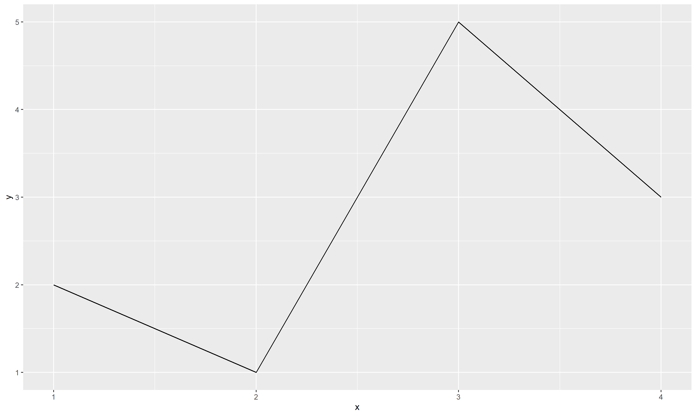
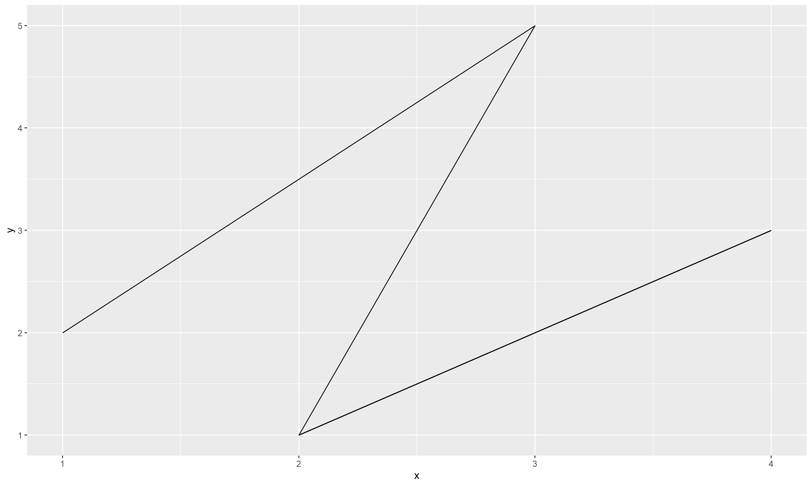

# Date: 02 December 2020

## Question:
The difference between `geom_path()` and `geom_line()` is:

## Topic:
1. Programming
2. R
3. GGPlot

## Options:
1. Both are same
2. `geom_line()` connects observations in original order whereas `geom_path()` connects observations ordered by x values
3. `geom_line()` connects observations ordered by x values whereas `geom_path()` connects observations in original order
4. None of the above

## Correct Option:
3. `geom_line()` connects observations ordered by x values whereas `geom_path()` connects observations in original order

## Explanation:
`geom_line()` connects observations ordered by x values whereas `geom_path()` connects observations in original order.

```r
tble = data.frame(x = c(1,3,2,4),
                  y = c(2,5,1,3))
tble
#>   x y
#> 1 1 2
#> 2 3 5
#> 3 2 1
#> 4 4 3
```
```r
ggplot(tble, aes(x,y)) + geom_line()
```


```r
ggplot(tble, aes(x,y)) + geom_path()
```


## Scripts:
1. Question Script: NULL
2. Answer Script: NULL

## Link:
1. Question Link: NULL
2. Answer Link: NULL

## Images:
1. Question Images: NULL
2. Answer Images:
   1. "../images/answers/a_02122020_1.png"
   2. "../images/answers/a_02122020_2.png"
   3. "../images/answers/a_02122020_3.png"
