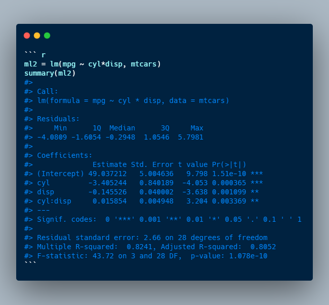

# Date: 05 August 2020

## Question:
Let's say you have a build a linear regression model using the following command:
```
lm(mpg ~ cyl*disp, mtcars)
```
What would the model predict at `cyl = 2` and `disp = 3`? Assume coefficient for intercept, cyl, disp and cyl:disp as i, c, d and c:d, respectively.



## Topic:
1. Linear Regression
2. R
3. Interaction Effect

## Options:
1. $i + c*2 + d*3$
2. $i + c*2 + d*3 + c:d*6$
3. $c*d*6$
4. None of the above

## Correct Option:
2. i + c\*2 + d\*3 + c:d\*6

## Explanation:
The * operator denotes factor crossing. `a*b` is interpreted as `a + b + a:b`. Here `a:b` means interaction between `a` and `b`. In other words, `mpg ~ cyl*disp` fits the model $$mpg = \beta_0 + \beta_1*cyl + \beta_2*disp + \beta_3*cyl*disp$$

## Scripts:
1. Question Script: NULL
2. Answer Script: NULL

## Link:
1. Question Link: NULL
2. Answer Link: NULL

## Images:
1. Question Images: 
   1. "../images/questions/q_05082020.png"
2. Answer Images: NULL
