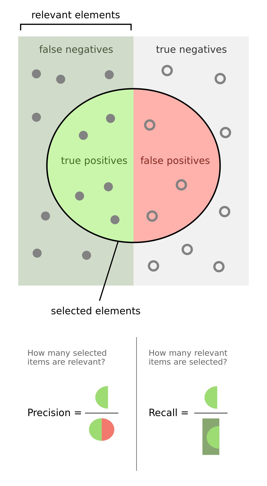

# Date: 06 September 2020

## Question:
Precision and recall are often at odds with each other. You are building a heart disease prediction model, which given a patient's records predicts whether the person has heart disease or not. Which one should you maximize over other?
 	
## Topic:
1. Data Science
2. Probability and Statistics
3. Type 1 error and Type 2 error

## Options:
1. Precision over Recall
2. Recall over Precision
3. Doesn't matter

## Correct Option:
2. Recall over Precision

## Explanation:
In the medical community, a false negative i.e. a person who in actual has the disease is predicted as not having the disease, is more disastrous than a false positive i.e. a person who in actual doesn't have the disease is predicted as having the disease. The following picture illustrates the difference between **Precision** and **Recall**. Recall is equal to $TP/(TP+FN)$ and Precision is equal to $TP/(TP+FP)$, as you can the difference between two is of FN and FP. On a side note, a mnemonic way to remember the formula could be, Precision has P so FP in denominator. Depending on which one is more riskier, whether having FP is more riskier than having FN or vice versa, one would minimize one over another. In the above question, FN is more riskier than FP, so minimizing FN should be the goal, which in turn maximizes the Recall. However, you could have 100% recall yet have a useless model: if your model always outputs a positive prediction, it would have 100% recall but be completely uninformative.

## Scripts:
1. Question Script: NULL
2. Answer Script: NULL

## Link:
1. Question Link: NULL
2. Answer Link: NULL

## Images:
1. Question Images: NULL
2. Answer Images:
   1. "../images/answers/a_06092020.png"
