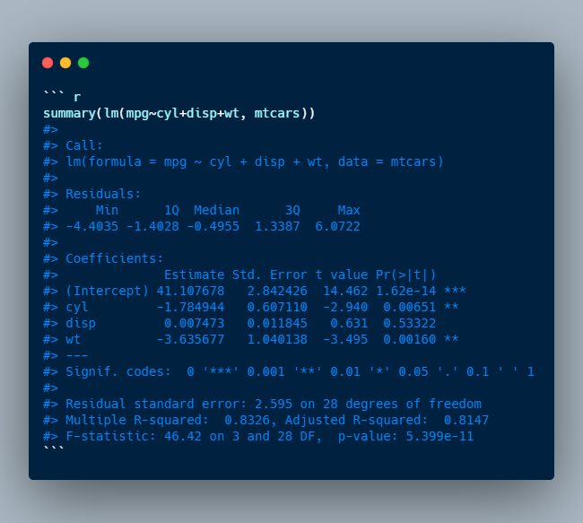

# Date: 07 August 2020

## Question:
While viewing the summary of linear regression model built in R, you sometime see stars for independent variables. For the following example, shown below, which interpretation is correct?

## Topic:
Linear Regression in R

## Options:
1. `Intercept` has the strongest relationship with mpg
2. Both `cyl` and `wt` have two stars, so both have equal linear relationship
3. $p-value for `cyl` > p-value for `wt`$, so $slope of `cyl` > slope of `wt`$
4. None of the above
 
## Correct Option:
4. None of the above

## Explanation:
The stars corresponds to different significance levels or the thresholds for $p-value$. Two star means $0.001 < p-value < 0.01$. Depending on your cut-off, you might choose to accept or reject the null hypothesis i.e. $\beta = 0$ for `cyl` (or `wt`) and accept the alternate hypothesis i.e. $\beta \neq 0$. Now if you are accepting the alternate hypothesis, can we say that `mpg` is linearly related with `cyl`? Not really, as without being linearly related, variables can still be significant. 

## Scripts:
1. Question Script: NULL
2. Answer Script: NULL

## Link:
1. Question Link: NULL
2. Answer Link: 
   1. "https://stats.stackexchange.com/questions/138860/is-using-correlation-matrix-to-select-predictors-for-regression-correct"

## Images:
1. Question Images: 
   1. "../images/questions/q_07082020.png"
2. Answer Images: NULL
