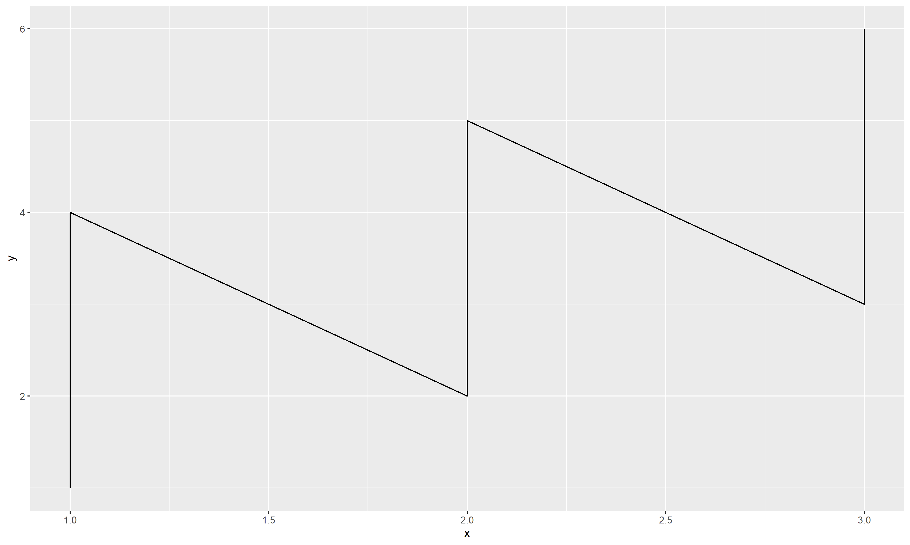
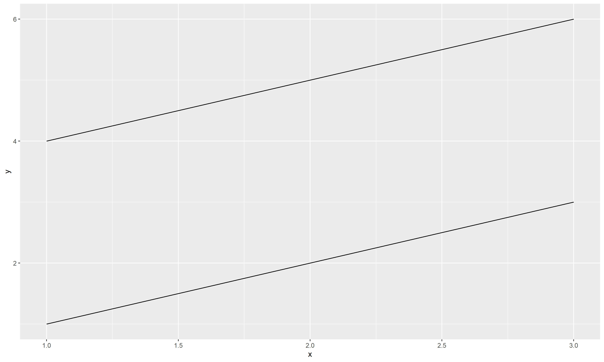
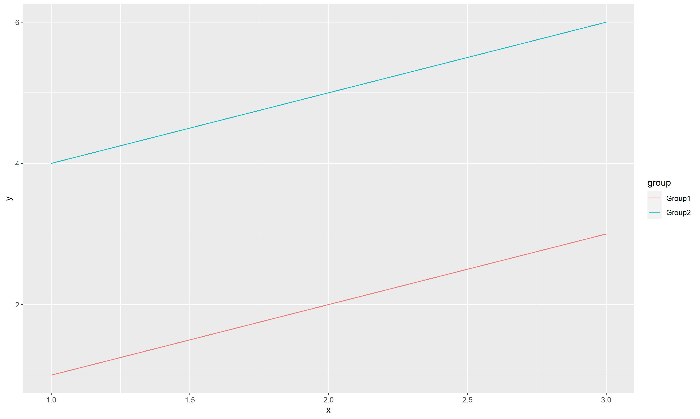

# Date: 07 December 2020

## Question:
Given the following table, which of the following two code snippet would give the same plot?

``` r
tble = data.frame('x' = rep(c(1,2,3),2),
                  'y' = c(1,2,3,4,5,6),
                  'group' = c(rep('Group1', 3), rep('Group2', 3)))
tble
#>   x y  group
#> 1 1 1 Group1
#> 2 2 2 Group1
#> 3 3 3 Group1
#> 4 1 4 Group2
#> 5 2 5 Group2
#> 6 3 6 Group2
```

1. `ggplot(tble, aes(x,y)) + geom_line()`
2. `ggplot(tble, aes(x,y,group=group)) + geom_line()`
3. `ggplot(tble, aes(x,y,fill=group)) + geom_line()`
4. `ggplot(tble, aes(x,y,color=group)) + geom_line()`

## Topic:
1. Programming
2. R
3. GGPlot

## Options:
1. All would gave the same plot
2. 1 and 2
3. 2 and 3
4. 3 and 4

## Correct Option:
3. 2 and 3

## Explanation:
Since in our data we have two groups: `Group1` and `Group2`, while plotting we need to specify correct grouping. If grouping is not specified, we get an incorrect plot as in for option 1.

```r
ggplot(tble, aes(x,y)) + geom_line()
```


The grouping can be specified by either of `group`, `fill`, `color` aesthetics. The difference between three is, with `group`, it won't add any color, but two separate lines. With `fill` it would fill the geoms with color, but since in this we are plotting a line, which can't be filled with color, hence it reverts back to default color setting of lines. Although, a line can be colored, which is the case with option 4, where we get two distinct line with distinct color.

```r
ggplot(tble, aes(x,y,group=group)) + geom_line()
```


```r
ggplot(tble, aes(x,y,fill=group)) + geom_line()
```


```r
ggplot(tble, aes(x,y,color=group)) + geom_line()
```


## Scripts:
1. Question Script: NULL
2. Answer Script: NULL

## Link:
1. Question Link: NULL
2. Answer Link: NULL

## Images:
1. Question Images:
   1. "../images/questions/q_07122020.png"
2. Answer Images:
   1. "../images/answers/a_07122020_1.png"
   2. "../images/answers/a_07122020_2.png" 
   3. "../images/answers/a_07122020_3.png"
   4. "../images/answers/a_07122020_4.png"
