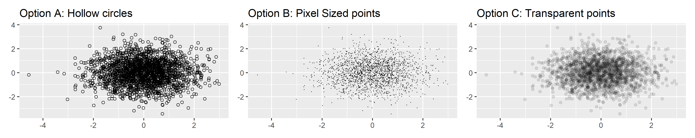

# Date: 08 December 2020

## Question:
Given the following plot in which you can see most of the points are overplotted. Which of the following option would help to alleviate the problem of overplotting?

```r
df <- data.frame(x = rnorm(2000), y = rnorm(2000))
norm <- ggplot(df, aes(x, y)) + xlab(NULL) + ylab(NULL)
norm + geom_point()
```


## Topic:
1. Programming
2. R
3. GGplot

## Options:
1. `norm + geom_point(shape=1)`
2. `norm + geom_point(shape=".")`
3. `norm + geom_point(alpha=1/10)`
4. All of the above

## Correct Option:
4. All of the above

## Explanation:
There are number of ways to deal with overplotting depending on the size of the data and severity of overplotting. The first two options alleviate the problem by tweaking the shapes of points, where first option plots hollow circles and option two plots pixel sized points. The third option can be useful for larger datasets. It uses alpha blending to make points transparent.

```r
library(ggplot2)
library(patchwork)

df <- data.frame(x = rnorm(2000), y = rnorm(2000))
norm <- ggplot(df, aes(x, y)) + xlab(NULL) + ylab(NULL)
p1 = norm + geom_point(shape=1) + labs(title = "Option A: Hollow circles")
p2 = norm + geom_point(shape=".") + labs(title = "Option B: Pixel Sized points") 
p3 = norm + geom_point(alpha=1/10) + labs(title = "Option C: Transparent points")

p1 + p2 + p3
```



## Scripts:
1. Question Script: NULL
2. Answer Script: NULL

## Link:
1. Question Link: NULL
2. Answer Link: NULL

## Images:
1. Question Images:
   1. "../images/questions/q_08122020.png"
2. Answer Images:
   1. "../images/answers/a_08122020_1.png"
   2. "../images/answers/a_08122020_2.png" 
