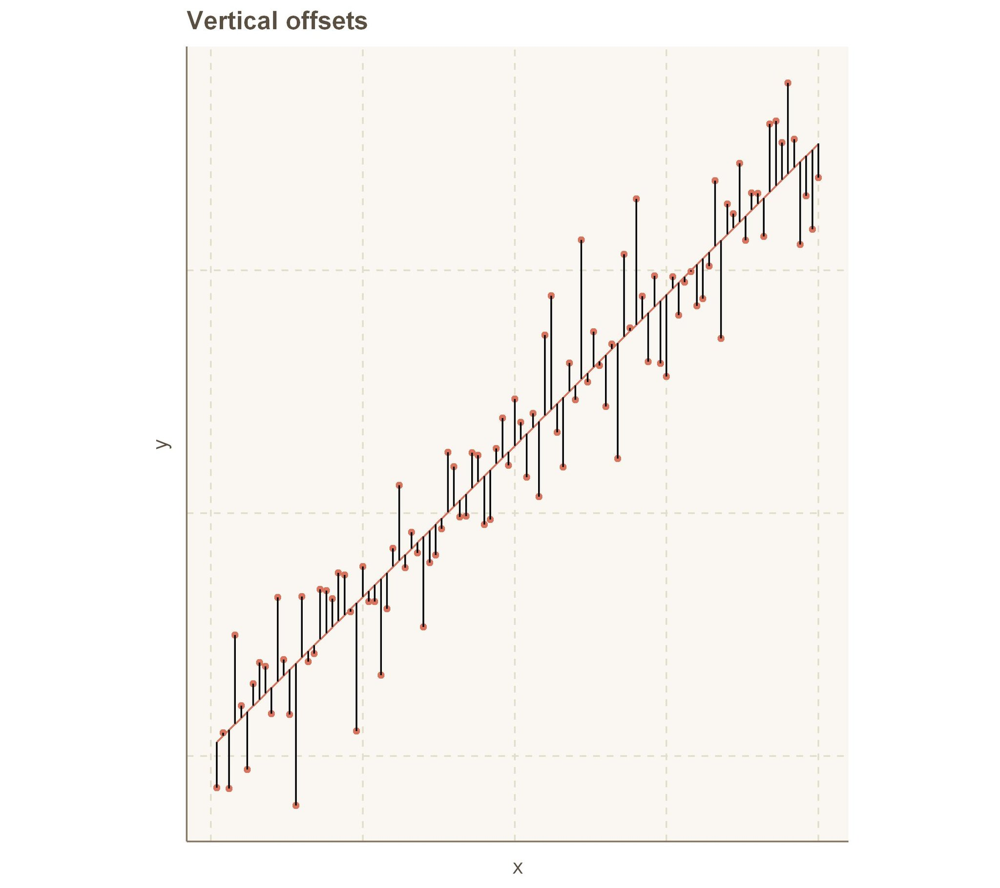

# Date: 09 August 2020

## Question:
Which of the following offset is used in linear least squares fitting?

## Topic:
Ordinary Least Squares Fitting

## Options:
1. Perpendicular offsets
2. Vertical offsets
3. None of the above

## Correct Option:
2. Vertical offsets

## Explanation:
In a linear regression setting, the most commonly used method to find the coefficients is by minimizing the sum of squares of residuals. The sum of squares of residuals is defined as:
$$R^2 = \sum[y_i- \hat{y_i}]^2$$
And $y_i - \hat{y_i}$ is nothing but vertical offsets. 

To find the coefficients, let's say for: $y = \beta_0 + \beta_1x$, minimize $R^2$ by differentiating with respect to $\beta_0$ and $\beta_1$ and equating the resulting equations to zero.

## Scripts:
1. Question Script: NULL
2. Answer Script: NULL

## Link:
1. Question Link: NULL
2. Answer Link: NULL

## Images:
1. Question Images:
   1. "../images/questions/q_09082020_1.png"
   2. "../images/questions/q_09082020_2.png"
2. Answer Images: NULL
