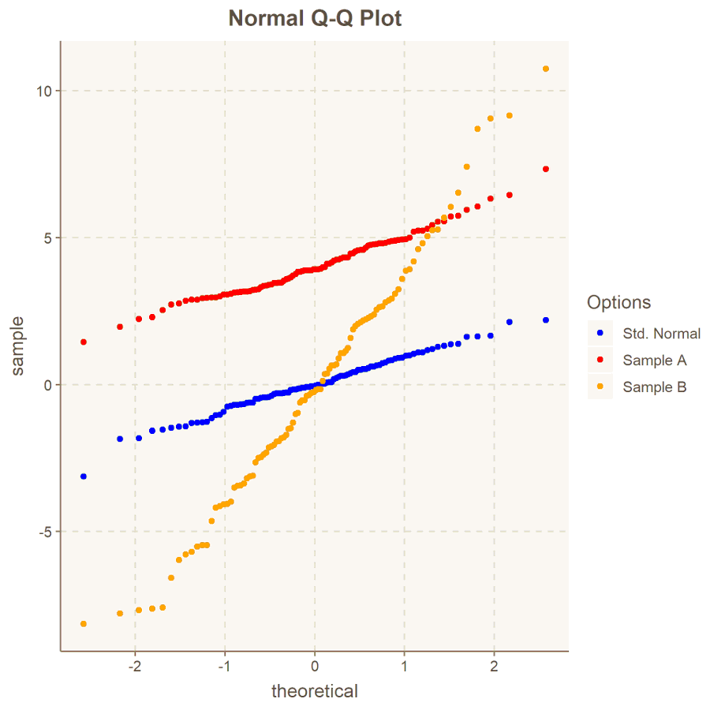
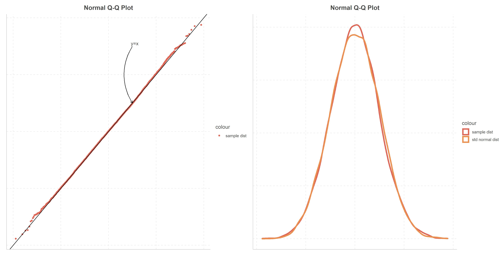
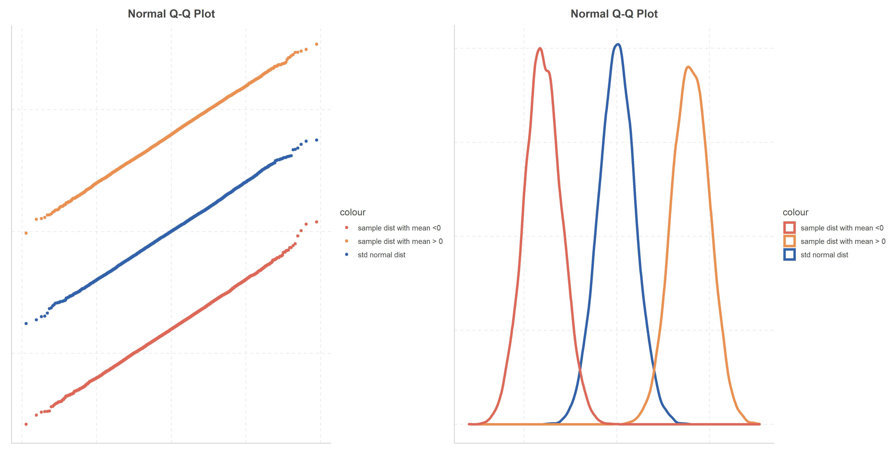
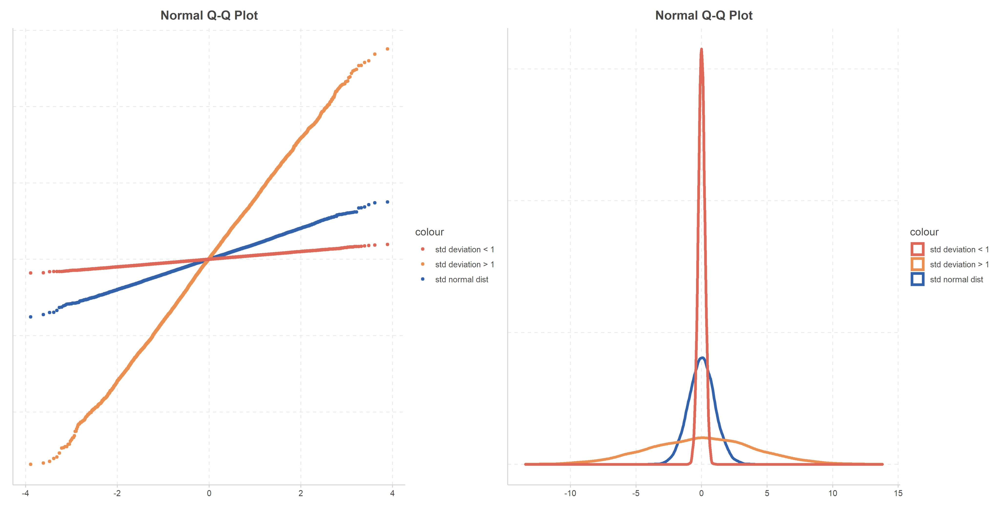

# Date: 10 September 2020

## Question:
Let's assume both samples A & B are from normal distribution, based on the following normal qq plot, which statement could be true?

1. Sample A appears to be parallel to Standard Normal, so mean of A > 0
2. Standard deviation of B > 1
3. Standard deviation of A < 1

## Topic:
1. Data Science
2. Probability and Statistics
3. Normal Q-Q plot

## Options:
1. 1 and 2 both are true
2. Only 2 is true
3. Only 3 is true
4. None of the above

## Correct Option:
1. A and B both are true

## Explanation:
Normal qq plot helps to check if the sample is following standard normal distribution. If it's the case, then we would expect the points to fall (nearly on) straight line $y = x$.

If the sample normal distribution has different mean, then we would expect an intercept on normal qq plot and it could lie above or below $y = x$ line, depending on the mean. The line would be parallel to $y = x$, if the standard deviation of distribution is 1.

If the sample normal distribution has different standard deviation (than 1), then the slope of the line would change. If the mean is zero, then the line would rotate around $(0, 0)$ and depending on standard deviation it could rotate clockwise (if standard deviation < 1) or anti-clockwise (if standard deviation > 1) with respect to $(0, 0)$. 

 
## Scripts:
1. Question Script: NULL
2. Answer Script: NULL

## Link:
1. Question Link: NULL
2. Answer Link: NULL

## Images:
1. Question Images:
   1. "../images/questions/q_10092020.png"
2. Answer Images: 
   1. "../images/answers/a_10092020_1.png"
   2. "../images/answers/a_10092020_2.png"
   3. "../images/answers/a_10092020_3.png"
