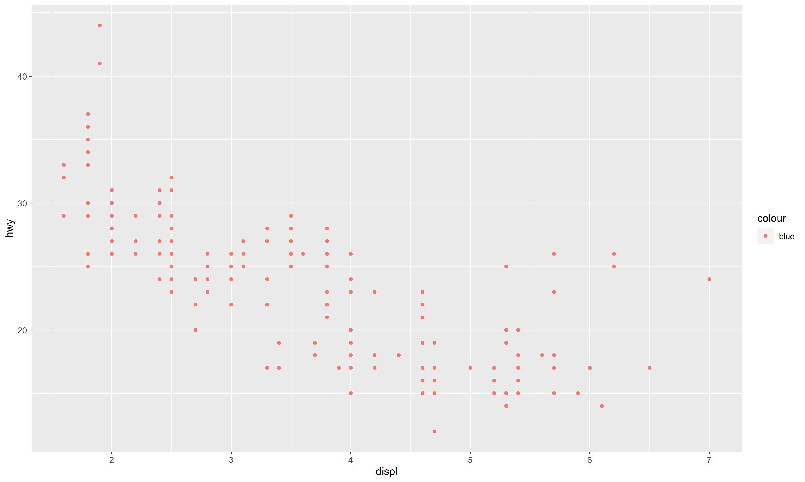
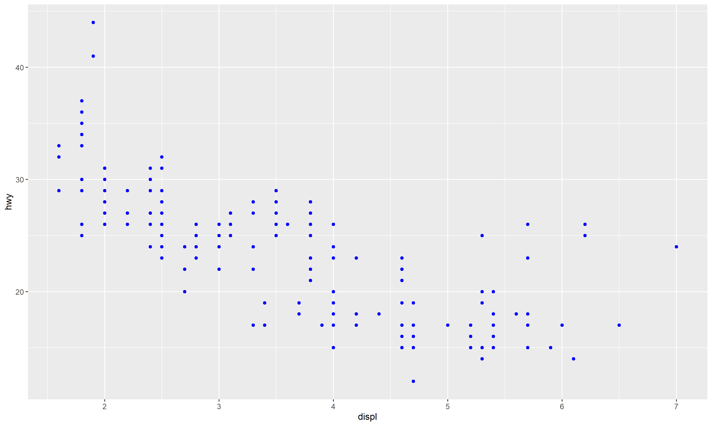

# Date: 10 November 2020

## Question:
In the following plot, for which you were trying to color the points blue, which one is the correct option to do so?



## Topic:
1. Programming
2. R
3. `ggplot`

## Options:
1. `ggplot(mpg, aes(displ, hwy)) + geom_point(aes(color = "blue"))`
2. `ggplot(mpg, aes(displ, hwy)) + geom_point(color = "blue")`
3. `ggplot(mpg, aes(displ, hwy, color = "blue")) + geom_point()`
4. None of the above

## Correct Option:
2. `ggplot(mpg, aes(displ, hwy)) + geom_point(color = "blue")`

## Explanation:
The aesthetic mappings, defined with `aes()`, describe how variables are mapped to visual properties or aesthetics. `aes()` takes a sequence of aesthetic-variable pairs like this:

```
aes(x = displ, y = hwy, colour = class)
```

In option 1 and 3, the color is mapped (not set) to "blue", this effectively creates a new variable containing only the value "blue" and then scales it with a color scale. Because this value is discrete, the default color scale uses evenly spaced colors on the color wheel, and since there is only one value this color is orangish. To set an aesthetic to a constant value, put it outside `aes()`.

```r
ggplot(mpg, aes(displ, hwy)) + geom_point(color = "blue")
```


## Scripts:
1. Question Script: NULL
2. Answer Script: NULL

## Link:
1. Question Link: NULL
2. Answer Link: NULL

## Images:
1. Question Images:
   1. "../images/questions/q_10112020.png" 
2. Answer Images:
   1. "../images/answers/a_10112020.png"
