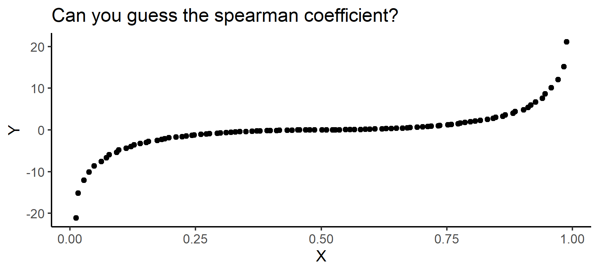

# Date: 14 August 2020

## Question:
As you can see from the following image, that $X$ and $Y$ are monotonically related. What would the spearman correlation coefficient between $X$ and $Y$. It's given that pearson correlation coefficient is 0.86.

## Topic:
1. Spearman coefficient

## Options:
1. 0.86
2. 1
3. -1
4. -0.86

## Correct Option:
2. 1

## Explanation:
A Spearman correlation of 1 results when the two variables being compared are monotonically related, even if their relationship is not linear. This means that all data points with greater x values than that of a given data point will have greater y values as well. In contrast, this does not give a perfect Pearson correlation.

## Scripts:
1. Question Script:
   1. "./scripts/q_14082020.R"
2. Answer Script: NULL

## Link:
1. Question Link:
   1. "https://en.wikipedia.org/wiki/Spearman%27s_rank_correlation_coefficient"
2. Answer Link: NULL

## Images:
1. Question Images: 
   1. "../images/questions/q_14082020.png"
2. Answer Images: NULL
