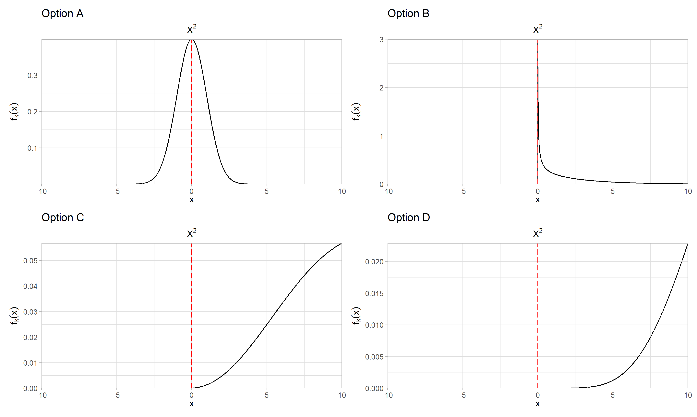

# Date: 15 September 2020

## Question:
Among the following options, which can't be a pdf of $\chi^{2}$ distribution?

## Topic:
1. Data Science
2. Probability and Statistics
3. Chi-squared Distribution

## Options:
1. Option A
2. Option B
3. Option C
4. Option D

## Correct Option:
1. Option A

## Explanation:
The chi-square distribution (also chi-squared or $\chi^{2}$-distribution) with k degrees of freedom is the distribution of a sum of the squares of k independent standard normal random variables.The $\chi^{2}$ distribution is an asymmetric distribution that has a minimum valueof 0, but no maximum value. For $x \leq 0$ the $PDF$ of $\chi^{2}$ is zero.

## Scripts:
1. Question Script:
   1. "./scripts/q_15092020.R"
2. Answer Script: NULL

## Link:
1. Question Link: NULL
2. Answer Link: NULL

## Images:
1. Question Images:
   1. "../images/questions/q_15092020.png"
2. Answer Images: NULL
