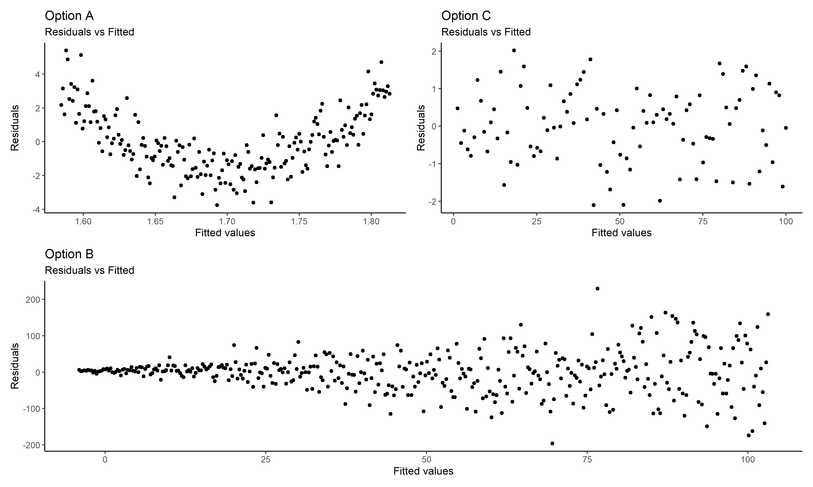

# Date: 16 August 2020

## Question:
Three important assumptions of linear regression are: linearity, homoscedasticity and normality. Two out of the following three models are violating two of the assumptions stated above. Which are those? (Assume you have to judge visually only)

## Topic:
1. Linear Regression

## Options:
1. Option A and Option B
2. Option B and Option C
3. Option C and Option D
4. None are violating the assumptions

## Correct Option:
1. Option A and Option B

## Explanation:
Residuals vs Fits plots is a scatter plot with residuals on the y axis and fitted values on the x asis. It is used to detect non linearity, unequal error variances and outliers. Option A, shows that there is a non-linear relationship between x and y, looks like a parabola. Option B is an example of unequal error variance (heteroscedasticity) as with increasing x the dispersion of residuals is also increasing. With option C, visually we confirm that there is no non linear relationship between x and y and the variance of residuals is also not dispersed.

## Scripts:
1. Question Script:
   1. "./scripts/q_16082020.R"
2. Answer Script: NULL

## Link:
1. Question Link: NULL
2. Answer Link: NULL

## Images:
1. Question Images:
   1. "../images/questions/q_16082020.png"
2. Answer Images: NULL
