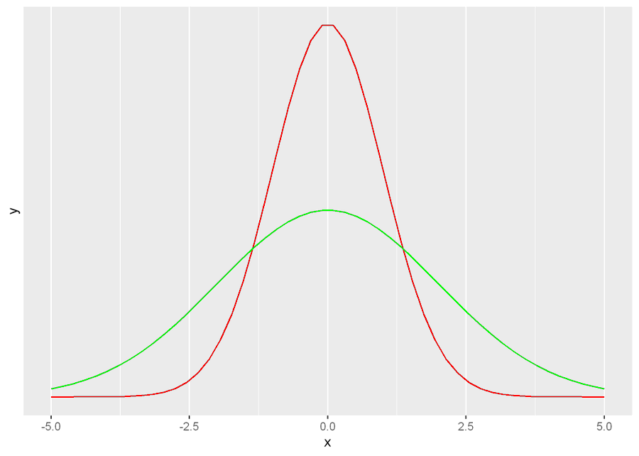

# Date: 21 August 2020

## Question:
Given the following normal distributions, what can you say about the green curve and red curve? (Assuming same number of observations for both curves and sd refers to std. deviation)

## Topic:
1. Normal Distribution

## Options:
1. $\sigma_{red} > \sigma_{green}$ 
2. $\sigma_{red} < \sigma_{green}$ 
3. $\sigma_{red} = \sigma_{green}$
4. None of the above

## Correct Option:
2. $\sigma_{red} < \sigma_{green}$ 

## Explanation:
Standard deviation is a measure of variability. It tells how much variation or dispersion there is from the average or expected value. Normal distributions with low standard deviation tend to be closer to mean, whereas normal distributions with high standard deviation tend to be dispersed away from mean. In this question both the curves have mean zero, but green curve is more dispersed than red curve hence it has higher standard deviation.

## Scripts:
1. Question Script: NULL
2. Answer Script: NULL

## Link:
1. Question Link: NULL
2. Answer Link: NULL

## Images:
1. Question Images:
   1. "../images/questions/q_21082020.png" 
2. Answer Images: NULL
