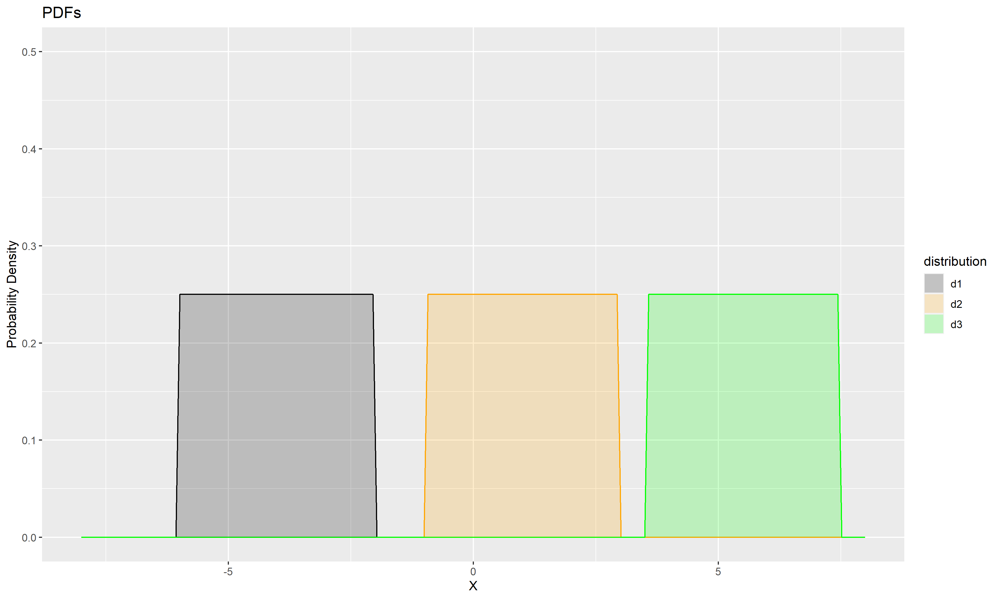

# Date: 23 September 2020

## Question:
Given the following uniform distributions $d_1$, $d_2$, $d_3$, what can you say about their mean $(\mu_i)$?

## Topic:
1. Data Science
2. Probability and Statistics
3. Uniform Distribution

## Options:
1. $\mu_1 > \mu_2 > \mu_3$
2. $\mu_1 < \mu_2 < \mu_3$
3. $\mu_1 < \mu_3 < \mu_2$

## Correct Option:
3. $\mu_1 < \mu_3 < \mu_2$

## Explanation:
The given distributions are uniform. A random variable $X$ has uniform distribution if it's pdf:
$$f(x) = \begin{cases}
\frac {1}{b-a} & \text{for x $\in$ [a,b]}\\
0 & \text{otherwise}\\
\end{cases}
$$
That is, pdf of $X$ is constant in the range [a,b]. The mean of $X$ is:
$$\begin{aligned}
E[X] &= \int xf(x)dx \\
&= \int_{a}^{b} \frac {1}{b-a}xdx + 0 \\
&= \frac {b-a}{2}\\
\end{aligned}
$$
So the mean of $X$ is the mid point $[a,b]$ i.e. we just need to find the midpoint of the values of x where it's pdf is not zero.

So for the above given graph, $\mu_1 < \mu_2 < \mu_3$.

## Scripts:
1. Question Script:
   1. "./scripts/q_23092020.R"
2. Answer Script: NULL

## Link:
1. Question Link: NULL
2. Answer Link: NULL

## Images:
1. Question Images:
   1. "../images/questions/q_23092020.png" 
2. Answer Images: NULL
