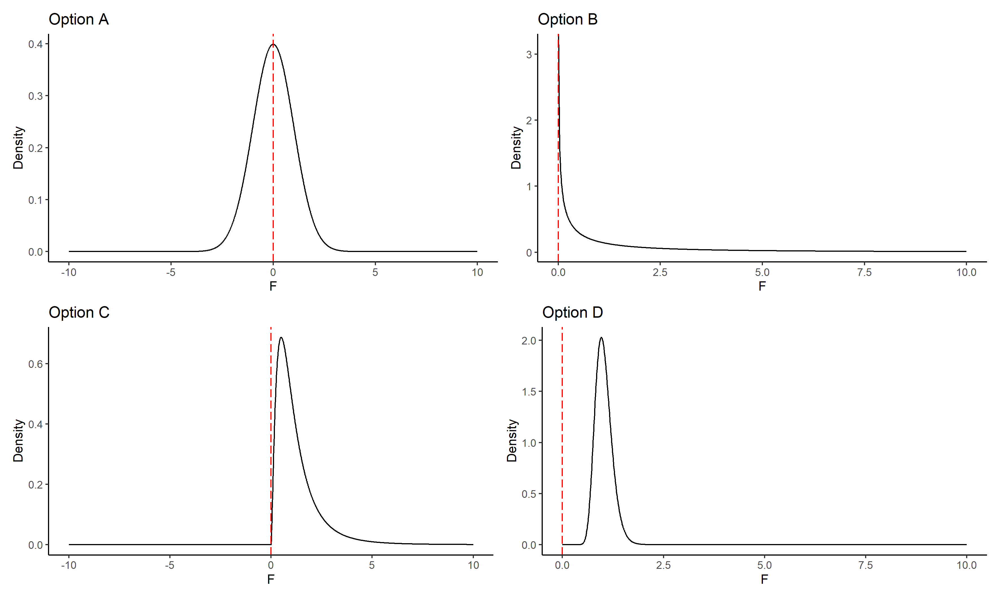

# Date: 24 August 2020

## Question:
Among the following options, which one can't be a F-statistic distribution plot?

## Topic:
1. F Distribution

## Options:
1. Option A
2. Option B
3. Option C
4. Option D 

## Correct Option:
3. Option A

## Explanation:
F-distribution arises frequently as the null hypothesis of a test-statistic, most notaly in the analysis of variance e.g. F-test.  As F-statistic is defined as the ratio of normalized variance within groups and normalized variance between groups, it's not possible to get F-statistic less than zero because variance is always non-negative.
 
## Scripts:
1. Question Script:
   1. "./scripts/q_24082020.R"
2. Answer Script: NULL

## Link:
1. Question Link: NULL
2. Answer Link: NULL

## Images:
1. Question Images:
   1. "../images/questions/q_24082020.png"
2. Answer Images: NULL
