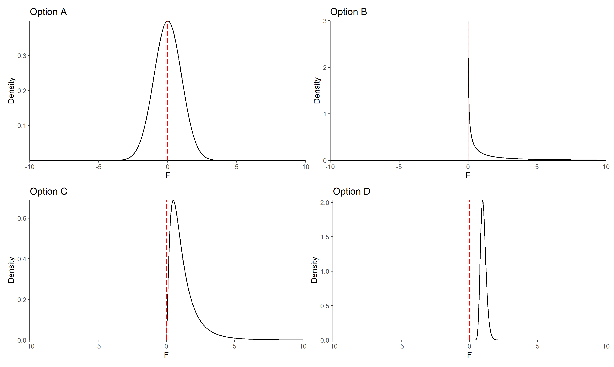

# Date: 24 August 2020

## Question:
Among the following options, which one can't be a PDF for F distribution?

## Topic:
1. F Distribution

## Options:
1. Option A
2. Option B
3. Option C
4. Option D 

## Correct Option:
3. Option A

## Explanation:
The F-distribution is formed by the ratio of two independent chi-squared variables divided by their respective degress of freedom. Many of the properties of chi-square gets carried forward:
1. The F-values are all non-negative
2. The distribution is non symmetric
3. There are two independent degrees of freedom, one for numerator and one for denominator
4. There are many F-distributions, one for each pair of degree of freedom

Also as an example, you could look at the F-distribution arising from F-test statistic used for ANOVA testing. The F-test statistic is defined as the ratio of variation between sample means and variation within samples divided by their respective degrees of freedom, and since variance is non negative, the F will also be non-negative.

## Scripts:
1. Question Script:
   1. "./scripts/q_24082020.R"
2. Answer Script: NULL

## Link:
1. Question Link: NULL
2. Answer Link: NULL

## Images:
1. Question Images:
   1. "../images/questions/q_24082020.png"
2. Answer Images: NULL
