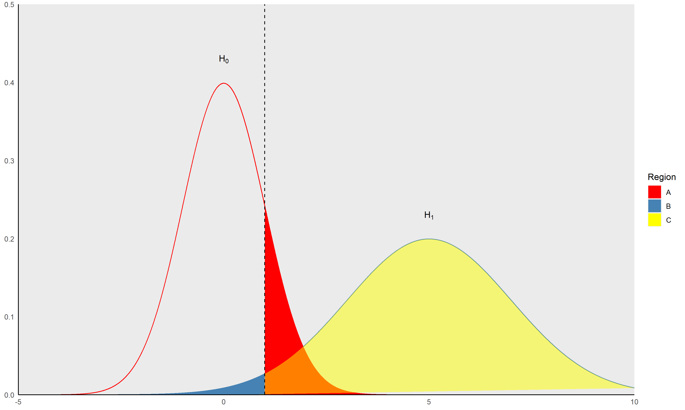

# Date: 26 September 2020

## Question:
In the following image, what does each region represent? (Assume dashed line represents the significance level)

## Topic:
1. Data Science
2. Probability and Statistics
3. Power

## Options:
1. A = $\alpha$; B = $\beta$; C = Power
2. A = $\beta$; B = $\alpha$; C = Power
3. A = Power; B = $\beta$; C = $\alpha$
4. A = $\beta$; B = Power; C = $\alpha$

## Correct Option:
1. A = $\alpha$; B = $\beta$; C = Power

## Explanation:
The region to the right of significance level and under $H_0$ is the probability of rejecting null hypothesis (the $\alpha$). The region to the left of significance level and under $H_1$ is the probability of not rejecting $H_0$ if $H_1$ was true (the $\beta$). Power is equal to $1 - $\beta$ and it is the region under $H_1$ and to the right of significance level. It is the probability of rejecting a false null hypothesis.

## Scripts:
1. Question Script:
   1. "./scripts/q_26092020.R" 
2. Answer Script: NULL

## Link:
1. Question Link: NULL
2. Answer Link: NULL

## Images:
1. Question Images:
   1. "../images/questions/q_26092020.png" 
2. Answer Images: NULL
