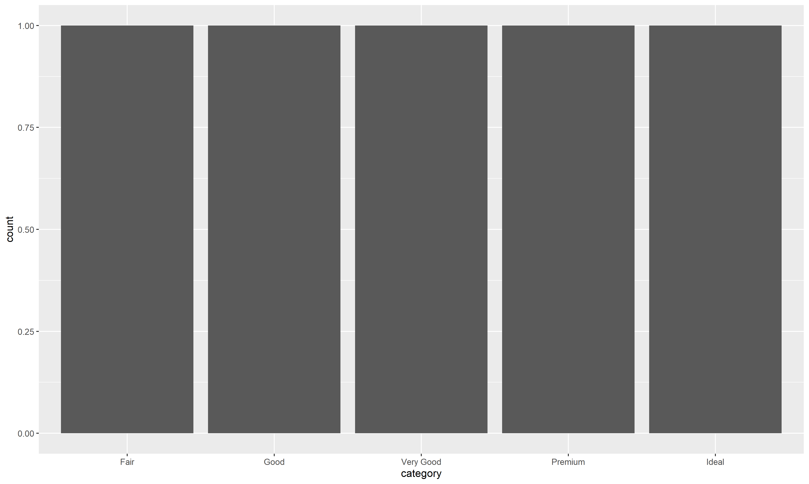
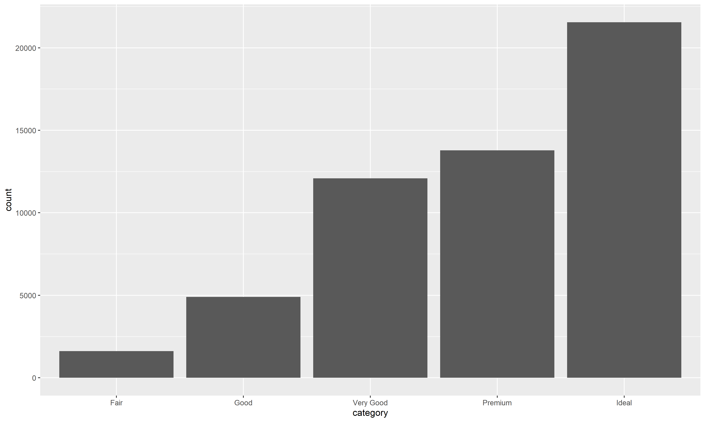

# Date: 30 November 2020

## Question:
Given the following dataframe, you intend to draw a bar chart with category (x-axis) and count (y-axis), using `ggplot()`. Which of the following command would give the correct bar chart?

```r
tble
#>    category count
#> 1      Fair  1610
#> 2      Good  4906
#> 3 Very Good 12082
#> 4   Premium 13791
#> 5     Ideal 21551
```

## Topic:
1. Programming
2. R
3. GGPlot

## Options:
1. `ggplot(tble, aes(x=category, y=count)) + geom_bar()`
2. `ggplot(tble, aes(x=category)) + geom_bar()`
3. `ggplot(tble, aes(x=category, y=count)) + geom_bar(stat='identity')`
4. `ggplot(tble, aes(y=count)) + geom_bar()`

## Correct Option:
3. `ggplot(tble, aes(x=category, y=count)) + geom_bar(stat='identity')`

## Explanation:
The default behaviour of `geom_bar()` automatically counts value and requires only x aesthetic i.e. `ggplot(tble, aes(x=category)) + geom_bar()`. But in our example, we already have the count, so we need to use `stat='identity'`, which leaves the data unchanged.

```r
ggplot(tble, aes(x=category)) + geom_bar()
```


```r
ggplot(tble, aes(x=category, y=count)) + geom_bar(stat='identity')
```


## Scripts:
1. Question Script: NULL
2. Answer Script: NULL

## Link:
1. Question Link: NULL
2. Answer Link: NULL

## Images:
1. Question Images: NULL
2. Answer Images:
   1. "../images/answers/a_30112020_1.png"
   2. "../images/answers/a_30112020_2.png" 
